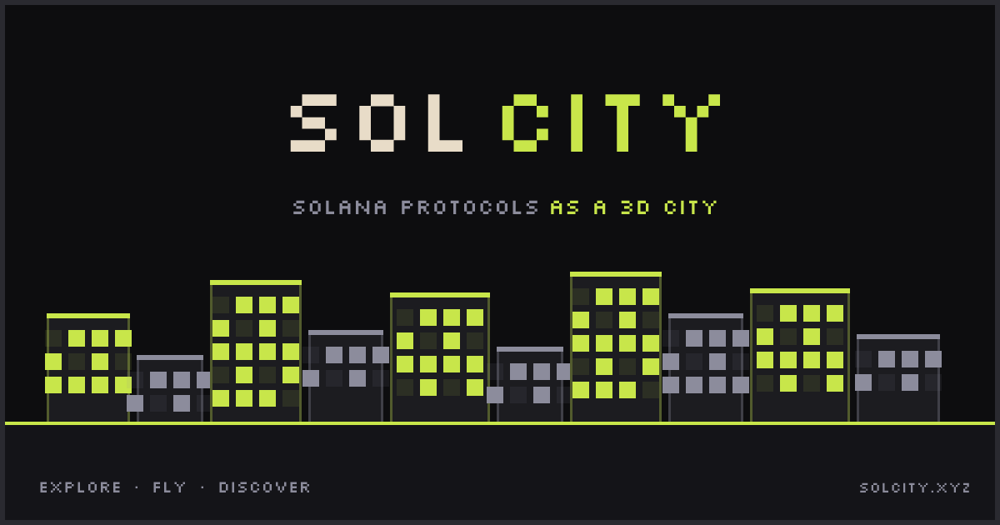

<h1 align="center">Sol City</h1>

<p align="center">
  <strong>Solana protocols visualized as 3D pixel art buildings in an interactive city.</strong>
</p>

<p align="center">
  
</p>

---

## What is Sol City?

Sol City transforms every Solana protocol into a unique pixel art building. The more TVL a protocol has, the taller its building grows. Explore an interactive 3D city, fly between buildings, connect your wallet, and track your on-chain activity.

## Features

- **3D Pixel Art Buildings** — Each Solana protocol becomes a building with height based on TVL, width based on category, and lit windows representing 24h volume
- **Free Flight Mode** — Fly through the city with smooth camera controls, visit any building, and explore the skyline
- **Protocol Pages** — Dedicated pages for each protocol with TVL, volume, fees, token price, and category
- **Wallet Integration** — Connect your Solana wallet to see your portfolio, token holdings, and transaction history
- **Resident System** — Claim a house in Sol City, customize its color, and appear on the leaderboard
- **Shop** — Customize your resident house color and profile from the Sol City shop
- **Leaderboard** — Multiple tabs: TVL, Volume 24h, Fees 24h, 24h Change, and Residents (PnL ranking)
- **Trading Stats** — PnL, win rate, trade count, and best/worst performing tokens via Vybe Network
- **Protocol Detection** — Automatically detects which Solana protocols your wallet has interacted with via Helius
- **Achievement System** — Unlock achievements based on on-chain activity and engagement

## How Buildings Work

| Metric         | Affects           | Example                                  |
|----------------|-------------------|------------------------------------------|
| TVL            | Building height   | $1B TVL → tallest building               |
| Category       | Building style    | DEX, Lending, Liquid Staking, Perps, etc |
| Volume 24h     | Window brightness | More volume → more lit windows           |
| Fees 24h       | Window pattern    | Active fees → distinct glow pattern      |

Buildings are rendered with instanced meshes and a LOD (Level of Detail) system for performance. Close buildings show full detail with animated windows; distant buildings use simplified geometry.

## Data Sources

| Source | Data |
|--------|------|
| [DeFiLlama](https://defillama.com) | TVL, volume, fees, protocol metadata, categories |
| [Helius](https://helius.dev) | Wallet balances, transaction history, protocol detection, identity |
| [Jupiter](https://jup.ag) | Token prices for protocol tokens |
| [Vybe Network](https://vybenetwork.xyz) | Wallet PnL, trading stats, token volume fallback |

## Tech Stack

- **Framework:** [Next.js](https://nextjs.org) 16 (App Router, Turbopack)
- **3D Engine:** [Three.js](https://threejs.org) via [@react-three/fiber](https://github.com/pmndrs/react-three-fiber) + [drei](https://github.com/pmndrs/drei)
- **Database:** [Supabase](https://supabase.com) (PostgreSQL, Row Level Security)
- **Blockchain:** Solana (wallet connect via @solana/connector)
- **Styling:** [Tailwind CSS](https://tailwindcss.com) v4 with pixel font (Silkscreen)
- **Hosting:** [Vercel](https://vercel.com)

## Getting Started

```bash
# Clone the repo
git clone https://github.com/jorger3301/sol-city.git
cd sol-city

# Install dependencies
npm install

# Set up environment variables
cp .env.example .env.local
# Fill in: SUPABASE_URL, SUPABASE_SERVICE_ROLE_KEY, HELIUS_API_KEY, VYBE_API_KEY

# Populate the database with Solana protocols
node --env-file=.env.local scripts/setup-db.mjs

# Run the dev server
npm run dev
```

Open [http://localhost:3000](http://localhost:3000) to see the city.

## Environment Variables

| Variable | Required | Description |
|----------|----------|-------------|
| `NEXT_PUBLIC_SUPABASE_URL` | Yes | Supabase project URL |
| `SUPABASE_SERVICE_ROLE_KEY` | Yes | Supabase service role key |
| `HELIUS_API_KEY` | Yes | Helius API key for wallet data |
| `VYBE_API_KEY` | Yes | Vybe Network API key for PnL data |
| `NEXT_PUBLIC_JUPITER_API_KEY` | No | Jupiter API key for token prices |
| `CRON_SECRET` | No | Secret for Vercel cron job authentication |

## API Endpoints

| Endpoint | Description |
|----------|-------------|
| `GET /api/city` | All protocols with building data |
| `GET /api/protocols` | Live protocol data from DeFiLlama |
| `GET /api/wallet/[address]` | Wallet balances, tokens, transfers, PnL |
| `GET /api/resident/[address]` | Resident profile and protocol interactions |
| `POST /api/resident/claim` | Claim a house (requires wallet auth) |
| `PUT /api/resident/claim` | Refresh protocol interactions |
| `GET /api/top-traders` | Resident traders ranked by PnL |
| `GET /api/residents` | All Sol City residents |
| `PATCH /api/resident/customize` | Update house color (requires wallet auth) |
| `GET /api/trending` | Trending protocols |

## License

[AGPL-3.0](LICENSE) — You can use and modify Sol City, but any public deployment must share the source code.

---

<p align="center">
  Built on Solana
</p>
